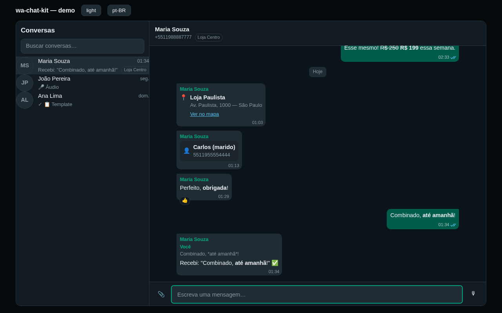

# wa-chat-kit

Reusable, customizable **WhatsApp conversation UI for React**. A complete two-pane inbox — conversation list + message thread — with every WhatsApp Cloud API message type rendered, optimistic sending, reply/quote, reactions, voice notes and a realtime-ready adapter contract. Backend-agnostic: you implement one `ChatAdapter` (Supabase, REST, websocket, whatever) and the kit does the rest.

```tsx
import { ChatApp, createMockAdapter } from 'wa-chat-kit';
import 'wa-chat-kit/styles.css';

export function Inbox() {
  return <ChatApp adapter={myAdapter} locale="pt-BR" />;
}
```



Run `npm run dev` for a full demo against the bundled mock adapter (all message types, simulated replies and status upgrades, light/dark, pt-BR/en/es).

## What's included

- **Conversation list** — search, unread badges (`99+` cap), last-message preview with type glyphs (📷 🎤 📄…), outbound tick mark, relative timestamps (HH:mm / weekday / date), multi-account badge (`accountLabel`, with an optional `accountColor` dot so each number reads as a group).
- **Thread view** — day separators (Hoje/Ontem), consecutive-message grouping, cursor pagination with **scroll-anchored prepend** (loading history never jumps), sticky-to-bottom with a "new messages" chip, 24h-session pill.
- **Every message type**: text (with WhatsApp `*bold*` `_italic_` `~strike~` ` ``` `mono` ``` ` formatting and URL autolinking — token-rendered, no `dangerouslySetInnerHTML`), image (lightbox), video, **audio player** (seek, elapsed/total duration swap, decode-error → download fallback), document (name/size/download), sticker (transparent bubble), location (maps link), contacts, template, interactive (rendered buttons/list + tapped answer), button (template quick replies), system, unsupported/unknown fallbacks.
- **Replies** — click-to-reply, composer reply banner, quoted block in the bubble, click the quote to scroll + pulse-highlight the original.
- **Reactions** — attached to the target bubble (never floating rows), quick-reaction picker, optimistic updates.
- **Status ticks** — sending → sent → delivered → read (blue) → failed (with error message), rank-guarded so a late `delivered` never downgrades a `read`.
- **Composer** — auto-growing textarea (IME-safe Enter-to-send), multi-file attachments with preview strip and object-URL cleanup, caption on first file, **send/mic morph button**, MediaRecorder voice notes (ogg/opus when the browser supports it, webm/opus fallback), 24h-window closed state with a host-provided CTA slot (e.g. your template picker).
- **Optimistic sends** with client-id reconciliation — the realtime insert, the HTTP response, or a content-match all converge on one bubble, in any arrival order.
- **i18n** — complete pt-BR (default), en and es built in; every label overridable via the `labels` prop.
- **Theming** — plain CSS with `--wck-*` custom properties; WhatsApp-faithful dark skin by default, light skin via `.wck-light`; responsive master/detail under 768px.

## The adapter contract

```ts
import type { ChatAdapter } from 'wa-chat-kit';

const adapter: ChatAdapter = {
  listConversations: ({ query }) => Promise<Conversation[]>,
  listMessages: ({ conversationId, before, limit }) => Promise<{ messages; hasMore }>,
  sendMessage: (input) => Promise<{ id?; externalId? }>, // text | media (File/Blob) | reaction
  markRead: (conversationId) => Promise<void>,
  resolveMediaUrl: (message) => Promise<string | null>, // signed URLs; kit caches ~55min
  subscribe: ({ onMessage, onMessageUpdate, onConversation }) => unsubscribe,
};
```

`ChatMessage` / `Conversation` are normalized, provider-agnostic shapes (see `src/core/types.ts`). `externalId` is the provider message id (WhatsApp `wamid`) — replies and reactions reference it.

## Composability

`ChatApp` is the batteries-included shell. Every layer is exported for custom layouts:

- Components: `ConversationList`, `ConversationView`, `MessageBubble`, `Composer`, `FormattedText`, `StatusTicks`
- Engine: `useChatController` (state machine: list, thread, pagination, optimistic sends, realtime merge), `useAudioRecorder`
- Core (no React): `tokenizeWhatsAppText`, `buildThreadItems`, `formatListTime`/`formatDayLabel`, `mergeStatus`, label packs
- Testing/design: `createMockAdapter`

## Theming

```css
.my-brand .wck-root {
  --wck-accent: #7c3aed;
  --wck-bubble-out: #4c1d95;
  --wck-radius: 16px;
}
```

## Development

```bash
npm install
npm run dev        # demo at http://localhost:5173
npm run verify     # format check + lint + typecheck + tests + build
```

MIT © Heverton Rodrigues
